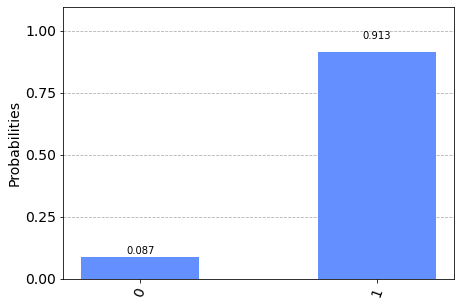

```python
%matplotlib inline
# Importing standard Qiskit libraries and configuring account
from qiskit import QuantumCircuit, execute, Aer, IBMQ, QuantumRegister
from qiskit.compiler import transpile, assemble
from qiskit.tools.jupyter import *
from qiskit.visualization import *
from qiskit.quantum_info import random_statevector
from qiskit.extensions import Initialize

# Loading your IBM Q account(s)
provider = IBMQ.load_account()
```

    ibmqfactory.load_account:WARNING:2020-08-01 06:45:11,115: Credentials are already in use. The existing account in the session will be replaced.


```python
from qiskit.visualization import plot_histogram
from math import sqrt, pi
import numpy as np
```


```python
qc = QuantumCircuit(1)
psi = random_statevector(2).data #상태벡터를 초기화 할 값을 생성합니다
init_gate = Initialize(psi) #양자 회로에 초기화할 값을 넣기 위해 초기 게이트를 만듭니다
qc.append(init_gate, [0] ) #양자회로에 초기화할 게이트를 적용합니다
qc.draw('text') #큐빗이 초기화 된 값을 확인합니다. 아직 회로가 구성되지 않았기 때문에 텍스트로 확인합니다
```


<pre style="word-wrap: normal;white-space: pre;background: #fff0;line-height: 1.1;font-family: &quot;Courier New&quot;,Courier,monospace">     ┌───────────────────────────────────────────────┐
q_0: ┤ initialize(0.23326+-0.18051j,0.42134+0.8576j) ├
     └───────────────────────────────────────────────┘</pre>


```python
state = execute(qc,backend).result().get_statevector() #상태벡터를 확인하기 위해 계산을 실행합니다.
print(state) #계산된 결과를 초기화한 값과 비교합니다.
```

    [0.23326479-0.18051426j 0.42133699+0.85759972j]


```python
results = execute(qc,backend).result().get_counts() #중첩된 상태의 확률을 확인하기 위해 계산을 실행합니다.
plot_histogram(results) #각 기저벡터의 확률 값을 확인합니다.

```





```python

```
