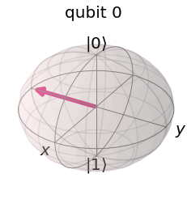
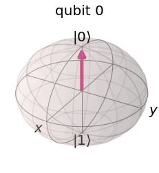

```python
%matplotlib inline
# Importing standard Qiskit libraries and configuring account
from qiskit import QuantumCircuit, execute, Aer, IBMQ, BasicAer
from qiskit.compiler import transpile, assemble
from qiskit.tools.jupyter import *

# Loading your IBM Q account(s)
provider = IBMQ.load_account()
```

    ibmqfactory.load_account:WARNING:2020-08-01 14:00:27,109: Credentials are already in use. The existing account in the session will be replaced.


```python
from qiskit.visualization import iplot_bloch_multivector
from numpy import sqrt
```


```python
#측정이 없는 양자 횔의 블로흐 구면
qc = QuantumCircuit(1)
initial_state = [0.+1.j/sqrt(2),1/sqrt(2)+0.j] #본문에 설명한 대로 큐빗을 초기화할 값을 설정합니다.
qc.initialize(initial_state, 0) #큐빗의 상태벡터를 정해진 값으로 초기화 합니다.

state = execute(qc,backend).result().get_statevector() #양자회로를 계산해서 상태벡터를 가져옵니다.

plot_bloch_multivector(state) #상태벡터를 블로흐 구면에 그려봅니다.
```





```python
#측정이 있는 양자 횔의 블로흐 구면
qc = QuantumCircuit(1)
initial_state = [0.+1.j/sqrt(2),1/sqrt(2)+0.j] #본문에 설명한 대로 큐빗을 초기화할 값을 설정합니다.
qc.initialize(initial_state, 0) #큐빗의 상태벡터를 정해진 값으로 초기화 합니다.
qc.measure_all()
state = execute(qc,backend).result().get_statevector() #양자회로를 계산해서 상태벡터를 가져옵니다.

plot_bloch_multivector(state) #상태벡터를 블로흐 구면에 그려봅니다.
```



